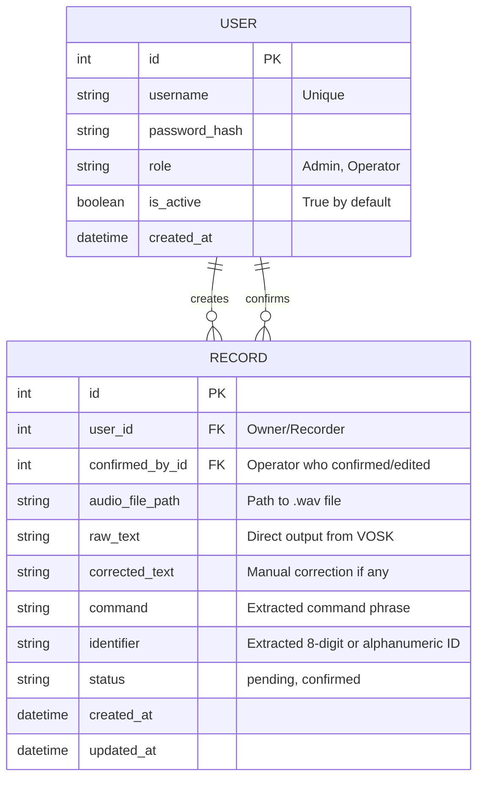

# Database Schema

This document defines the infological and datalogical models for the Voice Command Recognition System using SQLite and Flask-SQLAlchemy.

## Entity Relationship Diagram (ERD)

## Data Models (Datalogical)

### 1. User Table
Stores authentication and role-based access control (RBAC) data.

| Field | Type | Constraints | Description |
|---|---|---|---|
| `id` | Integer | Primary Key | Auto-incrementing ID |
| `username` | String(64) | Unique, Not Null | User login identifier |
| `password_hash` | String(128) | Not Null | Scrypt/Bcrypt hashed password |
| `role` | String(20) | Not Null | "Admin" or "Operator" |
| `is_active` | Boolean | Default True | Status for blocking/enabling accounts |
| `created_at` | DateTime | Default UTC.NOW | Account creation timestamp |

### 2. Record Table
Stores voice recognition results, metadata, and link to audio storage.

| Field | Type | Constraints | Description |
|---|---|---|---|
| `id` | Integer | Primary Key | Auto-incrementing ID |
| `user_id` | Integer | Foreign Key (User.id) | ID of the operator who recorded the audio |
| `confirmed_by_id` | Integer | Foreign Key (User.id) | ID of the operator who verified/corrected the result |
| `audio_file_path` | String(255) | Not Null | Relative path to the stored audio file on the server |
| `raw_text` | Text | | Original transcription from VOSK |
| `corrected_text` | Text | | Final text after manual verification |
| `command` | String(100) | | Extracted command (e.g., "Зарегистрировать") |
| `identifier` | String(100) | | Extracted ID (e.g., "P45345ИВ") |
| `status` | String(20) | Default "pending" | Status: "pending" or "confirmed" |
| `created_at` | DateTime | Default UTC.NOW | Recording timestamp |
| `updated_at` | DateTime | Default UTC.NOW | Last modification/confirmation timestamp |

## Data Integrity Rules
- **Foreign Keys**: `user_id` must reference a valid `User.id`. `confirmed_by_id` can be NULL until confirmation.
- **Constraints**: `username` must be unique to prevent duplicates.
- **Statuses**: Valid values for `status` are restricted to `pending` and `confirmed` in the application logic.
