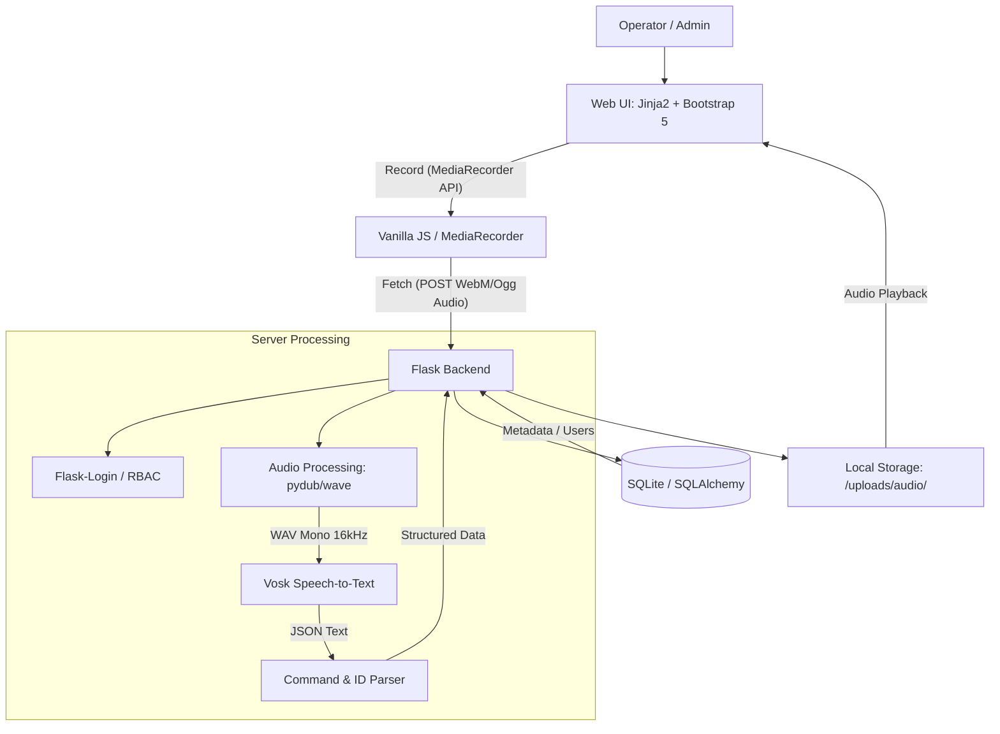

# System Architecture

This document describes the architectural components, technology stack, and data flow for the Voice Command Recognition System.

## Component Interaction Diagram (DFD)



## Technology Stack

| Layer | Technology | Reason / Role |
|---|---|---|
| **Backend Framework** | Flask | Lightweight, suitable for MVP rapid development. |
| **Frontend UI** | Jinja2 + Bootstrap 5 | Direct server-side rendering, responsive design. |
| **Authentication** | Flask-Login | Simple role-based session management. |
| **Database** | SQLite + SQLAlchemy | Zero-config database, integrated with Flask. |
| **Speech-to-Text** | VOSK (Russian model) | Offline recognition, lightweight, reliable. |
| **Audio Processing** | Pydub / Wave | Converting browser-native formats (WebM/Ogg) to VOSK-ready WAV. |
| **Client Audio API** | MediaRecorder API | Native browser support for capturing microphone input. |

## Data Flow Description

1. **Audio Capture**: The operator starts recording in the browser. The `MediaRecorder` API captures chunks and sends them to the Flask backend via a multipart POST request.
2. **Audio Conversion**: The backend receives the audio file (likely `.webm` or `.ogg`). It uses `pydub` to convert the file to a 16-bit Mono WAV format at 16,000Hz (VOSK standard).
3. **Recognition**: The converted audio is passed to the VOSK engine. VOSK returns a JSON structure containing the full transcribed text.
4. **Extraction (Parsing)**: The system applies regex/keyword matching to identify:
    - **Command**: One of the five predefined Russian phrases.
    - **Identifier**: 8-digit or alphanumeric ID.
5. **Persistence**: The original audio file is saved in the `/uploads/audio/` directory. Metadata (user, text, command, ID, timestamps) is saved in the SQLite database.
6. **Interaction**: The operator can then view, listen, and correct the results in the UI.

## File Structure (Planned)

```text
ya-profi/
├── .memory-bank/         # Design & Arch documentation
├── app/                  # Main application package
│   ├── __init__.py       # Flask app factory
│   ├── models.py         # SQLAlchemy models
│   ├── routes.py         # Flask routes (Views)
│   ├── auth.py           # Authentication logic
│   ├── recognition/      # VOSK integration & Audio processing
│   │   ├── vosk_engine.py
│   │   └── audio_converter.py
│   ├── static/           # JS, CSS, Audio uploads
│   │   ├── js/
│   │   ├── css/
│   │   └── uploads/
│   └── templates/        # Jinja2 templates
├── .env                  # Configuration variables
├── config.py             # App configuration
├── main.py               # Entry point
└── requirements.txt
```
