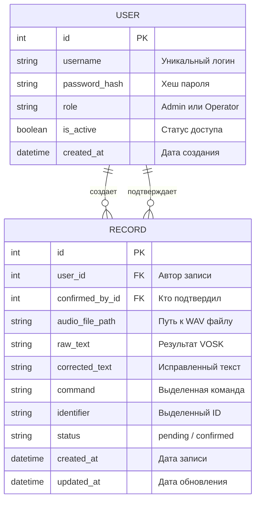
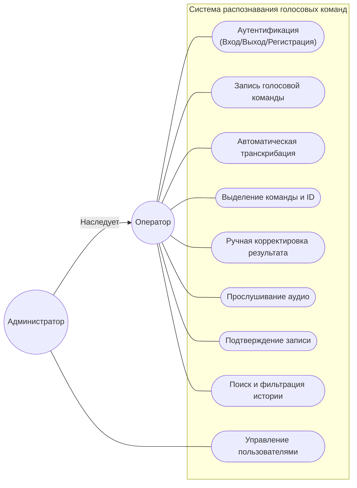

# Техническая архитектура системы распознавания голосовых команд

Данный документ содержит подробное описание архитектуры, технологий и процессов системы, разработанной в рамках MVP.

---

## 1. Схема решения и использование ИИ (Критерий 2.1)

### Общая схема взаимодействия компонентов (DFD)

```mermaid
graph TD
    User[Оператор / Админ] --> UI[Web UI: Jinja2 + Bootstrap 5]
    UI -- "Запись (MediaRecorder API)" --> ClientJS[Vanilla JS / MediaRecorder]
    ClientJS -- "Fetch (POST WebM/Ogg Audio)" --> Flask[Flask Backend]

    subgraph "Обработка на сервере"
        Flask --> Auth[Flask-Login / RBAC]
        Flask --> Converter[Конвертация: pydub/ffmpeg]
        Converter -- "WAV Mono 16kHz" --> VOSK[Vosk Speech-to-Text]
        VOSK -- "JSON Text" --> Parser[Парсер команд и ID (Regex)]
        Parser -- "Структурированные данные" --> Flask
    end

    Flask --> DB[(SQLite / SQLAlchemy)]
    Flask --> FS[Хранилище: /uploads/audio/]

    DB -- "Метаданные / Пользователи" --> Flask
    FS -- "Воспроизведение аудио" --> UI
```

### Использование ИИ и личный вклад

В процессе разработки проекта применялся подход AI-Assisted Development. В качестве основного ИИ-агента (кодогенератора) использовался Gemini CLI, а для помощи в структурировании и шлифовке промптов применялась диалоговая LLM Gemini PRO 3.1.

**Мой личный вклад (роль системного архитектора):**
1. **Анализ и выбор стека технологий:** Я самостоятельно проанализировал требования MVP и принял архитектурное решение отказаться от тяжелых JS-фреймворков (React/Next.js) в пользу связки Flask + SQLite + Vanilla JS. Это обеспечило легкость проекта и простоту развертывания.
2. **Проектирование пайплайна (Memory Bank):** Я разработал базовый системный промпт (файл `GEMINI.md`), который внедрил жесткий паттерн разработки "Design First". Я заставил ИИ-агента сначала создать единый источник правды (Single Source of Truth) в скрытой папке `.memory-bank` со всеми схемами БД и API, и только после моего утверждения переходить к написанию кода.
3. **Оркестрация и Code Review:** ИИ не работал автономно. Я разбил разработку на 3 фазы, проверял предложенную агентом архитектуру, проводил код-ревью каждого логического блока (например, проверял логику кэширования модели VOSK в памяти и безопасность регулярных выражений для парсинга) и направлял агента к следующим шагам. Основные концепции и бизнес-логика исходили от меня, а ИИ выступал в роли «умного компилятора».

**Лог основных промптов (согласно требованиям ТЗ):**
Ниже представлены ключевые управляющие промпты, которые я составлял и передавал ИИ-агенту по мере прохождения фаз разработки:

* **Инициализация проекта и архитектуры (Phase 1):**
  > «Ознакомься с ТЗ в файле Task.pdf и правилами работы в GEMINI.md. Начни выполнение проекта, строго следуя Phase 1 из Development Pipeline. Создай структуру `.memory-bank` и сгенерируй все необходимые схемы и документы. Жду отчет по Phase 1.»

* **Старт разработки и уточнение БД (Phase 2):**
  > «Отличная работа! Архитектура, схемы и БД спроектированы идеально и полностью соответствуют ТЗ. Перед тем как перейти к Phase 2 (Implementation), учти 3 небольших уточнения: 1. Добавь открытый роут `/register` для регистрации операторов. 2. Укажи `ffmpeg` как системную зависимость. 3. В логике парсера используй строгие Regex выражения для поиска 5 конкретных команд и извлечения идентификаторов. Обнови `.memory-bank` и переходи к Phase 2...»

* **Работа с аудио и интеграция VOSK:**
  > «Код-ревью пройдено успешно! [...] Переходи к следующим шагам: 1. Напиши клиентскую часть (`recorder.js`) с использованием `MediaRecorder API` для записи звука. 2. Создай модуль `vosk_engine.py`, где будет реализована конвертация аудио через `pydub` в нужный для VOSK формат (WAV Mono 16kHz) и само распознавание. 3. Реализуй строгий парсер (Regex). 4. Напиши роут `/record/upload`...»

* **Доработка UI и Админ-панели:**
  > «Код-ревью пройдено. Отличная работа! Особенно хвалю за реализацию `SpeechRecognizer._model` как переменной класса. Приступай к завершающим шагам Phase 2: 1. Создай шаблон `history.html` с таблицей и фильтрацией. 2. Создай интерфейс и роуты администратора для просмотра пользователей, блокировки и назначения ролей. Защити роуты проверкой `current_user.role == 'Admin'`. 3. Интегрируй новые страницы в меню.»

* **Генерация документации для сдачи (Phase 3):**
  > «Код-ревью пройдено блестяще! [...] Переходи к Phase 3: Deliverables & Finalization. Создай `README.md` (инструкция для эксперта с указанием установки ffmpeg и модели VOSK), `USER_MANUAL.md` (сценарий демонстрации). Обнови лог ИИ и проверь соответствие схем в `.memory-bank` финальному коду.»

* **Сборка архитектурного документа:**
  > «Нам необходимо подготовить финальный сводный документ для проверяющего эксперта... На основе всех файлов из директории `.memory-bank` создай в корне проекта Markdown-файл с названием `TECHNICAL_ARCHITECTURE.md`. Собери в нем: Схему решения (DFD), Описание технологий, Структуру БД (ERD), и UML Use Case диаграммы.»

Полный базовый системный промпт [GEMINI](./GEMINI.md)
Полные сырые промпты сохранены в [ai_prompts_log](.memory-bank/ai_prompts_log.md)

---

## 2. Описание предлагаемых технологий (Критерий 2.2)

Для реализации MVP был выбран стек технологий, обеспечивающий высокую скорость разработки, надежность и возможность автономной работы (offline).

| Уровень | Технология | Обоснование выбора |
|---|---|---|
| **Backend Framework** | Flask | Легковесный фреймворк, идеален для создания MVP без лишних накладных расходов. |
| **Frontend UI** | Jinja2 + Bootstrap 5 | Позволяет быстро создать отзывчивый интерфейс с серверным рендерингом, без использования сложных JS-фреймворков. |
| **Authentication** | Flask-Login | Стандартное решение для управления сессиями и ролями пользователей в Flask. |
| **Database** | SQLite + SQLAlchemy | Не требует отдельного сервера БД, легко переносится, полностью покрывает потребности MVP. |
| **Speech-to-Text** | VOSK (Russian model) | Офлайн-распознавание (не требует API-ключей), высокая точность для русского языка, работа на CPU. |
| **Audio Processing** | Pydub / FFmpeg | Универсальный инструмент для приведения различных аудио-форматов из браузера к единому стандарту VOSK (WAV 16kHz). |
| **Client Audio API** | MediaRecorder API | Нативный браузерный API, позволяющий захватывать звук с микрофона без сторонних плагинов. |

---

## 3. Структура базы данных (Критерий 2.3)

### ER-диаграмма (Инфологическая модель)



### Описание таблиц (Датологическая модель)

#### 1. Таблица `users` (Пользователи)
Хранит данные для аутентификации и разграничения прав доступа.
- `id` (Integer, PK): Уникальный идентификатор.
- `username` (String, Unique): Логин пользователя.
- `password_hash` (String): Захешированный пароль (безопасное хранение).
- `role` (String): Роль пользователя (`Admin` — полный доступ, `Operator` — работа с командами).
- `is_active` (Boolean): Флаг активности аккаунта (позволяет блокировать доступ).

#### 2. Таблица `records` (Записи и результаты)
Хранит результаты распознавания и метаданные.
- `id` (Integer, PK): Уникальный идентификатор.
- `user_id` (Integer, FK): Ссылка на оператора, сделавшего запись.
- `confirmed_by_id` (Integer, FK): Ссылка на пользователя, подтвердившего или исправившего результат.
- `audio_file_path` (String): Относительный путь к аудиофайлу в хранилище.
- `raw_text` (Text): Исходный текст, полученный от VOSK.
- `corrected_text` (Text): Текст после ручной правки оператором.
- `command` (String): Извлеченная ключевая фраза (одна из 5 допустимых).
- `identifier` (String): Извлеченный 8-значный цифровой или буквенно-цифровой код.
- `status` (String): Состояние записи (`pending` — ожидает проверки, `confirmed` — проверена).

---

## 4. Процессы, сценарии и потоки (Критерий 2.4)

### UML-диаграмма прецедентов (Use Case)



### Описание информационных потоков
1. **Захват и передача**: Браузер (JS) захватывает аудиопоток, формирует Blob и отправляет его на сервер через POST-запрос.
2. **Преобразование**: Сервер получает файл, сохраняет его во временную папку и использует `ffmpeg` (через `pydub`) для конвертации в формат Mono WAV 16kHz.
3. **Распознавание**: Конвертированный файл передается в движок VOSK. Результат возвращается в формате JSON.
4. **Анализ**: Специальный модуль на базе регулярных выражений ищет в тексте совпадения с эталонными командами и шаблонами идентификаторов (8 цифр или буквенно-цифровые коды).
5. **Отображение и хранение**: Результат возвращается пользователю на UI и одновременно сохраняется в SQLite со статусом "Ожидает подтверждения".

### Основные пользовательские сценарии

#### Сценарий 1: Запись и распознавание (Оператор)
Оператор входит в систему, нажимает кнопку записи и диктует команду. Система мгновенно отображает распознанный текст, выделенную команду и найденный идентификатор. Оригинальное аудио сохраняется и доступно для прослушивания.

#### Сценарий 2: Корректировка результата (Оператор)
Если VOSK распознал текст неточно (например, из-за шума), оператор нажимает "Редактировать", прослушивает аудио и вручную вносит исправления в поля команды или ID. После сохранения статус записи меняется на "Подтвержден".

#### Сценарий 3: Поиск и верификация (Оператор/Админ)
В разделе "История" пользователь может найти записи по дате, типу команды или конкретному идентификатору. Это позволяет быстро проверить выполнение команд в прошлом.

#### Сценарий 4: Администрирование (Администратор)
Администратор заходит в панель управления пользователями, где может изменить роль любого пользователя (например, повысить Оператора до Админа) или заблокировать аккаунт в случае необходимости. Изменения вступают в силу немедленно.
